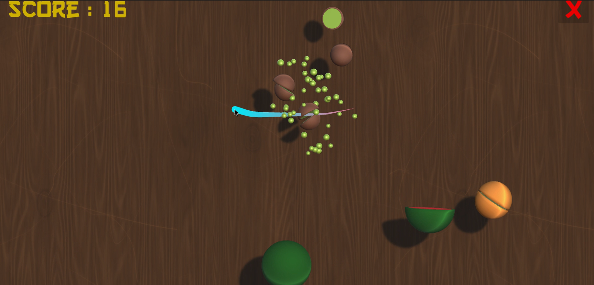

# Fruit Ninja Game

Welcome to the Fruit Ninja Game - Basic Implementation! This Unity game brings you a simple and enjoyable fruit-slicing experience. Slice through fruits, dodge dangerous bombs, and aim for the highest score!

## Features

1. **Slice Fruits:**
   - Users can slice through a variety of fruits with a satisfying cutting mechanic.

2. **Avoid Bombs:**
   - Bombs are scattered among the fruits. Be cautious and avoid slicing them to prevent score deductions.

3. **High Score Challenge:**
   - Compete with yourself and others by aiming for the highest score possible.

## Screenshot

## Download the Game

- To play the game, download the latest release from the [GitHub Releases](https://github.com/NyanCyanide/Ninja-Fruit/releases/tag/v1.1) section.

## How to Play

1. **Extract the Zip File:**
   - Once the zip file is downloaded, extract its contents to your desired location.

2. **Launch the Game:**
   - Find the game executable (e.g., FruitNinja.exe) within the extracted folder.
   - Double-click the executable to start playing.

3. **Game Controls:**
   - Use the mouse or touch input to slice through fruits.
   - Avoid slicing bombs to maintain your score.

4. **Scoring:**
   - Different fruits offer various points when sliced.
   - Aim for a high score and challenge yourself in each playthrough.

## System Requirements

- **Operating System:**
  - Windows 7 and above

- **Processor:**
  - Dual-core processor or equivalent

- **Memory:**
  - 2GB RAM

- **Graphics:**
  - DirectX 10-compatible graphics card

## Known Issues

- As a basic implementation, the game may have limited features compared to more advanced versions.

## Feedback

If you encounter any issues, have suggestions, please open an issue or reach out.

Thank you for playing the Fruit Ninja Game. Have a fruitful gaming experience!
